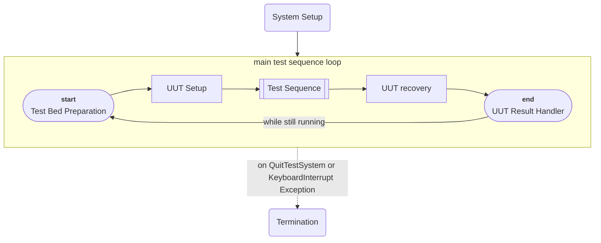

# The Test Framework

A humble attempt to a Python framework which aims to remove boilerplate code
from production (as in manufacturing) test systems. Consider 
[Missing Features](#missing-features).

## Procedures

The test system is distinguishing the following procedures.

* The **System Setup** procedure hosts those tasks which are usually only done
  once. E.g.:
  * Reading configuration files.
  * Setting up a GUI for the test.
  * Initializing external hardware (not necessarily part of the system setup).
  * User Management.
* The **Test Bed Preparation** procedure is used to prepare the test bed to 
  accept the next DUT without causing any damage to it. Like ensuring all 
  power-supplies are turned off.
* The **UUT Setup** procedure is executed in advance of the actual test. It may
  take care about:
  * Registering UUT serial number(s).
  * Fetching device specific firmware.
  * Fetching additional UUT specific information from a database.
* The **Test Sequence** is where the actual UUT testing happens. Flaky UUTs
  often surprise in ways which weren't anticipated during test development.
  Once in a while, erratic UUT behavior is exploiting such shortcomings so that
  a test might stall infinitely or unhandled exceptions cause the program to
  crash. To avoid situations where one must nuke the running instance to
  recover and maybe risking the loss of data relevant to investigate the 
  failure, the *Test Sequence* is launched in a sub-process, such that it can
  be terminated by the test system itself, without losing the overall context
  or having to revisit *System Setup*. **But this comes at a cost!** It 
  limits the data, which can be passed between the *Test Sequence* and the 
  other procedures.
* The **UUT Recovery** is issued immediately after the **Test Sequence**. It
  can be used to fetch logs from a failed UUT or to undertake rescue attempts
  to re-install a bootloader after a botched software installation.
* The **UUT Result Handler** can be used to submit test results to a database.




### Registration of Procedures

The framework manages the main execution loop. All one must do is registering
procedures. This is done like:

```python
from the_test_framework.core import TestSystem

test_system = TestSystem()

@test_system.system_setup
def your_custom_system_setup():
    """your custom code to set up the test system (optional)"""

@test_system.test_bed_preparation
def your_custom_test_bed_preparation():
    """code to prepare the test bed (optional)"""

@test_system.uut_setup
def your_custom_uut_setup():
    """stuff to register an about-to-be-tested UUT (optional)"""

@test_system.test_sequence
def your_custom_test_sequence():
    """here you arrange all your tests into a test sequence"""

@test_system.uut_recovery
def your_attempt_to_save_a_uut():
    """rescue a botched UUT before shutting down power supplies (optional)"""

@test_system.uut_result_handler
def your_custom_test_result_handler():
    """submit the test result to your database 
    or prompt the result to the operator (optional)"""
```

### Passing Data Between Procedures

One might want to pass data between the procedures. E.g. One might have read
a configuration during **System Setup** which one would like to pass to the
**Test Sequence**.
This can be achieved by flagging an argument of the receiving function:

```python
from typing import Annotated
from the_test_framework.core import TestSystem, IsSystemSetupData

test_system = TestSystem()

@test_system.system_setup
def system_setup() -> dict[str, str]:
    return {"config item": "something configurable ..."}


@test_system.test_sequence
def test_sequence(
    system_setup_data: Annotated[dict[str, str], IsSystemSetupData]
):
    ...
```

In above example, `system_setup()` returns `dict[str, str]` containing some
configuration. We want to access this configuration from the `test_sequence()`.
Thus, we specify the `system_setup_data` parameter. Its name is arbitrary. To
instruct *the test framework* to provide the result of the execution of the
`system_setup()` call, we have to flag it with `IsSystemSetupData`. Flagging
requires the somewhat cumbersome:

```
                                 system_setup()
                                  return type
                                 ┌───────────┐
    system_setup_data: Annotated[dict[str, str], IsSystemSetupData]
    └───────────────┘                            └───────────────┘
       arbitrary                                    indicating
       parameter                                   system setup
         name                                      is requested
```


### Requesting Test Result Info

**UUT Recovery** and **UUT Result Handler** may request the test result like:

```python
from the_test_framework.core import TestSystem, TestResultInfo

test_system = TestSystem()

@test_system.uut_recovery
def uut_recovery(
    # requests the test result info:
    test_result: TestResultInfo,
 ): ...
```

`Annotated[...]` syntax isn't required, as there is no ambiguity related to the
type of the requested data.

### ExitStacks

The idea of a **system-teardown** was dropped as the approach taken by
*the test framework* would force too much spacial separation between the
**system-setup**, and it's teardown. The concern was that this separation
is detrimental for maintaining a clear picture of which resources are allocated
and which ones are torn down. Making it easy to miss a thing.
Further, as one likely has to make the resource available in both: **\*-setup**
and **\*-teardown**, one would be forced to explicitly pass the objects from
one to the other; yielding more complex data structures.
So, the approach chosen instead is using an
[ExitStack](https://docs.python.org/3/library/contextlib.html#contextlib.ExitStack).
The callbacks registered as **system-setup** and **uut-setup** may request an
ExitStack via their signature, like:

```python
from typing import Annotated
from the_test_framework.core import TestSystem, IsSystemSetupData
from contextlib import ExitStack

test_system = TestSystem()


class MyPreciousResource:
    def open(self):
        """acquire the resource"""
    
    def close(self):
        """release the resource"""


@test_system.system_setup
def system_setup(
        exit_stack: ExitStack,
):
    my_precious_resource = MyPreciousResource()
    my_precious_resource.open()
    
    # registering the closing of the resource:
    exit_stack.callback(my_precious_resource.close)


@test_system.uut_setup
def uut_setup(exit_stack: ExitStack):
    # UUT setup callback can request an ExitStack as well!
    ...
```

#### Unwinding ExitStacks

The **system-setup**s exit stack is unwinded after an exception arisen from the
loop. This might be a rather harmless one, like `QuitTestSystem` or 
`KeyboardInterrupt` indicating the user likes to terminate the process.
The **uut-setup**s exit stack is unwinded immediately after the 
**test-sequence** returned.

```
┌── initialize system-setup-exit-stack
│   system_setup(system-setup-exit-stack)
│   while not yet terminated:
│       test_bed_preparation()
│ ┌──── initialize uut-setup-exit-stack 
│ │     uut_setup(uut-setup-exit-stack)
│ │     test_sequence()
│ └───→ unwind uut-setup-exit-stack
│       uut_recovery()
│       uut_result_handler()
└─→ unwind system-setup-exit-stack
```

### Requestable Data Overview

|                        | `IsSystemSetupData` | `IsUUTSetupData` | `IsTestSequenceData` | `TestResultInfo` | `ExitStack`  |
|------------------------|---------------------|------------------|----------------------|------------------|--------------|
| `system_setup`         | no                  | no               | no                   | no               | system stack |
| `test_bed_preparation` | yes                 | no               | no                   | no               | no           |
| `uut_setup`            | yes                 | no               | no                   | no               | UUT stack    |
| `test_sequence`        | yes                 | yes              | no                   | no               | no           |
| `uut_recovery`         | yes                 | yes              | yes                  | yes              | no           |
| `uut_result_handler`   | yes                 | yes              | yes                  | yes              | no           |


## Test Steps

### Test Result Determination

1. A test step which aborts due to an exception is considered a failed test.  
   (one can voluntarily fail a test by raising `FailedTest` exception).
2. An instance of `TestResult` returned by a test step is taken for face value.
3. An instance of `CustomTestResult` returned by a test step is taken for face value.
4. **A test step returning `False` is nevertheless considered a successful test.**


## Missing Features

- [ ] Running **Test Sequence** in a sub-process.